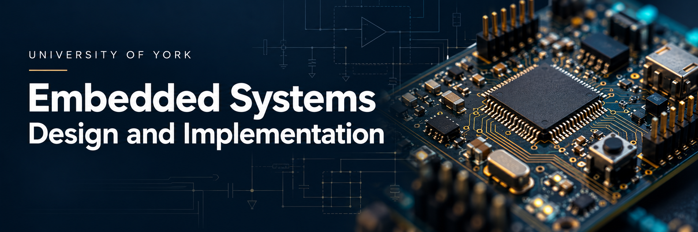

---
hide:
  - toc
---

University of York · EMBS

# Embedded Systems Design and Implementation

A companion to the EMBS module. Explore the principles of embedded systems, the trade-offs between hardware and software, and the algorithms that bring them together.

Dr <a href="https://www.xiaotiandai.com">Steven Xiaotian Dai</a> · Department of Computer Science

[Start with the module overview →](getting-started/overview.md)

[Find your lecture →](getting-started/lecture-guide.md)

## 0. Getting started

- [Module overview](getting-started/overview.md) — Aims, learning outcomes, and module structure
- [Lecture guide](getting-started/lecture-guide.md) — Reading and worked examples for lectures 0–18
- [How to use this book](getting-started/how-to-use.md) — Navigation and conventions

## 1. Embedded systems design

- [Introduction](embedded-systems-design/introduction.md) — Characteristics, design metrics, and the design process
- [FPGA design and implementation](embedded-systems-design/fpga.md) — Configurable hardware, design tools, and processor integration

## 2. Specification

- [Introduction](specification/introduction.md) — Requirements and models of computation
- [Ptolemy II](specification/ptolemy.md) — Actors, directors, hierarchy, and execution
- [Models of computation](specification/models-of-computation.md) — Continuous time, discrete events, and dataflow
- [KPN and synchronous dataflow](specification/dataflow.md) — Determinism, balance equations, schedules, and buffers

## 3. Hardware/software co-design

1. [Introduction](hw-sw-codesign/introduction.md) — Principles and the design process
2. [Design space exploration](hw-sw-codesign/design-space-exploration.md) — Trade-offs and Pareto analysis
3. [Partitioning](hw-sw-codesign/partitioning.md) — Dividing work between hardware and software
4. [Mapping](hw-sw-codesign/mapping.md) — Assigning tasks to computing resources

## 4. Embedded software and RTOS

- [Embedded software design](rtos/embedded-software.md) — Compilation, execution-time bounds, and processor customisation
- [Introduction](rtos/introduction.md) — Tasks, scheduling, and kernel services
- [FreeRTOS](rtos/freertos.md) — Task states, communication, interrupts, and memory

## 5. Real-time scheduling

- [Introduction](real-time-scheduling/introduction.md) — Task models, scheduling policies, and schedulability tests
- [Fixed-priority scheduling](real-time-scheduling/fixed-priority.md) — RM, DM, response-time analysis, and priority assignment
- [EDF and processor demand](real-time-scheduling/edf.md) — Demand bounds, PDA, and QPA with a worked example

## 6. Resource sharing, multicore, and mixed criticality

- [Introduction](multicore-resource-sharing/introduction.md) — Extending the independent task model
- [Resource sharing](multicore-resource-sharing/resource-sharing.md) — Priority inheritance, ceilings, and blocking bounds
- [Multicore scheduling](multicore-resource-sharing/multicore.md) — Global, partitioned, and semi-partitioned execution
- [Mixed-criticality systems](multicore-resource-sharing/mixed-criticality.md) — Execution budgets, mode changes, and timing guarantees

## Interactive tutorials

- [Kernighan–Lin algorithm](tutorials/kl-algorithm.md) — Move nodes and step through graph partitioning
- [Diffusion load balancing](tutorials/diffusion-algorithm.md) — Watch load flow between neighbouring nodes until it evens out
- [PDA vs QPA](tutorials/pda-qpa.md) — Compare two exact EDF schedulability tests on random task sets

## Practical work and resources

Follow the [practical exercises](https://iangray001.github.io/embs/docs/practicals/) alongside your reading.

[Department of Computer Science](https://www.york.ac.uk/computer-science/) · [GitHub repository](https://github.com/embs-book/embs-book.github.io)
